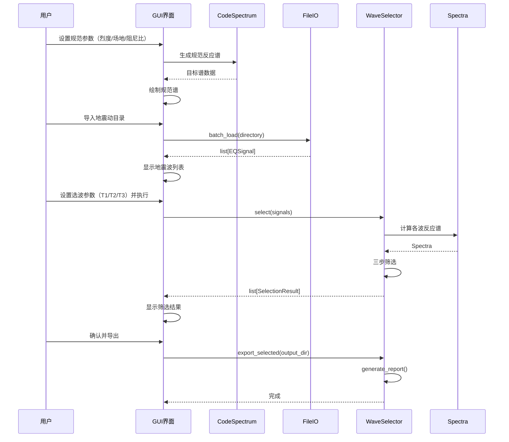

# EQSignalPy v2 - 技术设计

## 架构概览

采用经典的 MVC 分层架构：核心计算库（Model）+ GUI 界面（View）+ 控制逻辑（Controller）。核心库保持纯 Python 可独立使用（`import eqsignalpy`），GUI 层基于 PySide6 提供 Windows 桌面体验。

```
eqsignalpy/
├── core/              # 核心计算库（纯 Python，无 GUI 依赖）
│   ├── signal.py      # 地震信号类（EQSignal）
│   ├── spectrum.py    # 反应谱计算（Spectra）
│   ├── code_spec.py   # 规范反应谱生成
│   ├── selector.py    # 选波引擎
│   ├── generator.py   # 人工波生成（谱拟合）
│   ├── filter.py      # 滤波与基线校正
│   ├── fft.py         # FFT / PSD
│   └── io.py          # 文件读写（AT2/txt/csv）
├── gui/               # PySide6 GUI
│   ├── main_window.py # 主窗口
│   ├── panels/        # 功能面板
│   ├── widgets/       # 自定义控件
│   └── workers.py     # 后台计算线程
├── resources/         # 图标、样式表
└── __main__.py        # 入口点
```

## 组件设计

### 1. EQSignal（core/signal.py）

地震信号核心类，融合 EQSignal C++ 的 API 设计。

```python
class EQSignal:
    """地震信号处理核心类"""
    
    def __init__(self, acc: np.ndarray, dt: float, 
                 name: str = "", v0: float = 0.0, d0: float = 0.0):
        self.acc = acc          # 加速度时程 (m/s² 或 g)
        self.vel = None         # 速度时程
        self.disp = None        # 位移时程
        self.dt = dt            # 时间步长
        self.name = name        # 记录名称
        self.n = len(acc)       # 数据点数
    
    # --- I/O ---
    @classmethod
    def from_at2(cls, filepath: str) -> 'EQSignal': ...
    @classmethod
    def from_txt(cls, filepath: str, dt: float, skip_rows: int = 0, 
                 single_col: bool = True) -> 'EQSignal': ...
    @classmethod
    def batch_load(cls, directory: str, pattern: str = "*.AT2") -> list['EQSignal']: ...
    def save_txt(self, filepath: str): ...
    def save_at2(self, filepath: str): ...
    def save_csv(self, filepath: str): ...
    
    # --- 信号处理 ---
    def a2vd(self, raw: bool = False) -> None: ...
    def baseline_correction(self, method: str = "poly", order: int = 2) -> None: ...
    def filter(self, ftype: str = "bandpass", order: int = 4, 
               f1: float = 0.1, f2: float = 25.0) -> None: ...
    def trim(self, i1: int, i2: int) -> None: ...
    def auto_trim(self, thd1: float = 0.02, thd2: float = 0.98) -> tuple[int, int]: ...
    def normalize(self) -> None: ...
    def scale(self, factor: float) -> None: ...
    def resample(self, new_dt: float) -> None: ...
    
    # --- 分析 ---
    def compute_response_spectrum(self, periods: np.ndarray = None, 
                                   zeta: float = 0.05,
                                   method: str = "newmark") -> 'Spectra': ...
    def compute_fft(self) -> tuple[np.ndarray, np.ndarray]: ...
    def compute_psd(self, overlap: float = 0.5) -> tuple[np.ndarray, np.ndarray]: ...
    def arias_intensity(self) -> np.ndarray: ...
    
    # --- 属性 ---
    @property
    def pga(self) -> float: ...
    @property
    def duration(self) -> float: ...
    @property
    def effective_duration(self, threshold: float = 0.1) -> float: ...
    @property
    def time(self) -> np.ndarray: ...
```

### 2. Spectra（core/spectrum.py）

反应谱计算，移植 EQSignal C++ 的多方法支持。

```python
class Spectra:
    """反应谱计算与存储"""
    
    def __init__(self, periods: np.ndarray, zeta: float = 0.05):
        self.periods = periods   # 周期数组
        self.zeta = zeta         # 阻尼比
        self.sa = None           # 加速度反应谱
        self.sv = None           # 速度反应谱
        self.sd = None           # 位移反应谱
        self.se = None           # 能量谱
    
    @staticmethod
    def default_periods(p1: float = 0.04, p2: float = 10.0, 
                        n: int = 200, mode: str = "mixed") -> np.ndarray:
        """生成默认周期数组（短周期对数+长周期线性，同 EQSignal）"""
        ...
    
    @staticmethod
    def compute(acc: np.ndarray, dt: float, periods: np.ndarray, 
                zeta: float = 0.05, method: str = "newmark") -> 'Spectra':
        """计算反应谱
        method: "newmark" | "freq" | "mixed"
        """
        ...
    
    @staticmethod
    def _newmark_beta(acc, dt, omega, zeta) -> tuple: ...
    
    @staticmethod
    def _freq_domain(acc, dt, omega, zeta) -> tuple: ...
    
    def plot(self, ax=None, **kwargs): ...
    def save_csv(self, filepath: str): ...
```

**性能关键**：反应谱计算是最耗时的部分。使用 NumPy 向量化 + 可选 Numba JIT：

```python
# 向量化 Newmark-β：一次计算所有周期点
# 对每个周期，SDOF 系统的 Newmark 迭代是 O(N) 的
# 总复杂度 O(N_periods × N_steps)
# 用 @numba.jit(nopython=True, parallel=True) 加速内层循环
```

### 3. CodeSpectrum（core/code_spec.py）

规范反应谱生成，融合 EQSignal C++ 的 `setSPT`（7种规范）和 MATLAB 的隔震谱。

```python
class CodeSpectrum:
    """规范设计反应谱（v2 仅实现 GB 50011）"""
    
    # GB 50011 参数表
    # 设计地震分组 × 场地类别 → 特征周期 Tg
    GB_TG = {
        # (分组, 场地类别): Tg
        (1, "I0"): 0.20, (1, "I1"): 0.25, (1, "II"): 0.35, (1, "III"): 0.45, (1, "IV"): 0.65,
        (2, "I0"): 0.25, (2, "I1"): 0.30, (2, "II"): 0.40, (2, "III"): 0.55, (2, "IV"): 0.75,
        (3, "I0"): 0.30, (3, "I1"): 0.35, (3, "II"): 0.45, (3, "III"): 0.65, (3, "IV"): 0.90,
    }
    
    # 地震影响系数最大值
    GB_ALPHA_MAX = {
        "frequent":  {6: 0.04, 7: 0.08, 7.5: 0.12, 8: 0.16, 8.5: 0.24, 9: 0.32},
        "basic":     {6: 0.12, 7: 0.23, 7.5: 0.34, 8: 0.45, 8.5: 0.68, 9: 0.90},
        "rare":      {6: 0.28, 7: 0.50, 7.5: 0.72, 8: 0.90, 8.5: 1.20, 9: 1.40},
    }
    
    @staticmethod
    def gb50011(periods: np.ndarray, Tg: float, alpha_max: float, 
                zeta: float = 0.05, isolation: bool = False) -> np.ndarray:
        """GB 50011 抗震/隔震规范谱
        
        抗震谱（四段式）：
        - T < 0.1: 直线上升段
        - 0.1 ≤ T ≤ Tg: 水平段
        - Tg < T ≤ 5Tg: 曲线下降段
        - 5Tg < T ≤ 6.0: 直线下降段
        
        隔震谱（三段式）：
        - T < 0.1: 直线上升段
        - 0.1 ≤ T ≤ Tg: 水平段
        - Tg < T ≤ 6.0: 曲线下降段（无直线下降段）
        """
        ...
    
    @staticmethod
    def get_params(intensity: float, group: int, site_class: str,
                   level: str = "frequent") -> dict:
        """根据设防参数查表获取 Tg 和 alpha_max
        intensity: 6/7/7.5/8/8.5/9
        group: 1/2/3（设计地震分组）
        site_class: "I0"/"I1"/"II"/"III"/"IV"
        level: "frequent"/"basic"/"rare"（多遇/设防/罕遇）
        """
        ...
    
    @staticmethod
    def from_params(periods: np.ndarray, intensity: float, group: int,
                    site_class: str, level: str = "frequent",
                    zeta: float = 0.05, isolation: bool = False) -> np.ndarray:
        """便捷接口：直接从设防参数生成规范谱"""
        ...
```

### 4. WaveSelector（core/selector.py）

选波引擎，移植 MATLAB 的三步筛选逻辑。

```python
@dataclass
class SelectionCriteria:
    """选波参数"""
    Tg: float                    # 特征周期
    alpha_max: float             # 地震影响系数最大值
    T_main: list[float]          # 结构主要周期 [T1, T2, T3]
    zeta: float = 0.05           # 阻尼比
    duration_factor: float = 5.0 # 有效持时倍数（≥ factor × T1）
    spectral_tol: float = 0.20   # 反应谱偏差容限（20%）
    shear_check: bool = False    # 是否进行底部剪力校核
    shear_range: tuple = (0.65, 1.35)  # 底部剪力比范围
    mass: np.ndarray = None      # 质量矩阵（底部剪力校核用）
    stiffness: np.ndarray = None # 刚度矩阵（底部剪力校核用）
    code: str = "GB50011"        # 规范类型
    isolation: bool = False      # 是否隔震

@dataclass
class SelectionResult:
    """单条波的筛选结果"""
    signal: EQSignal
    effective_duration: float
    deviations: dict[str, float]  # {T1: 0.15, T2: 0.08, T3: 0.12}
    shear_ratio: float = None     # 底部剪力比
    passed: bool = True

class WaveSelector:
    """地震波选取引擎"""
    
    def __init__(self, criteria: SelectionCriteria):
        self.criteria = criteria
        self.target_spectrum = None  # 目标规范谱
        self.results: list[SelectionResult] = []
    
    def select(self, signals: list[EQSignal], 
               progress_callback=None) -> list[SelectionResult]:
        """执行三步筛选
        1. 有效持时筛选
        2. 主周期点反应谱偏差校核
        3. 底部剪力校核（可选）
        """
        ...
    
    def _check_duration(self, signal: EQSignal) -> tuple[bool, float]:
        """步骤一：有效持时检查"""
        ...
    
    def _check_spectral_deviation(self, signal: EQSignal) -> tuple[bool, dict]:
        """步骤二：主周期点反应谱偏差"""
        ...
    
    def _check_base_shear(self, signal: EQSignal) -> tuple[bool, float]:
        """步骤三：底部剪力校核（Newmark 时程分析 vs SRSS）"""
        ...
    
    def generate_report(self, output_dir: str) -> str:
        """生成选波报告"""
        ...
    
    def export_selected(self, output_dir: str, fmt: str = "at2") -> None:
        """导出选中的地震波文件"""
        ...
```

### 5. WaveGenerator（core/generator.py）

人工波生成，移植 EQSignal C++ 的 `fitSP` 迭代谱拟合算法。

```python
class WaveGenerator:
    """人工地震波生成器"""
    
    @staticmethod
    def generate(target_spectrum: np.ndarray, periods: np.ndarray,
                 n: int = 4096, dt: float = 0.02, zeta: float = 0.05,
                 pga: float = 1.0, tol: float = 0.05, max_iter: int = 50,
                 progress_callback=None) -> EQSignal:
        """基于目标反应谱迭代生成人工地震波
        
        算法流程（移植自 EQSignal fitSP）：
        1. 生成初始白噪声，施加包络函数
        2. 计算当前波的反应谱
        3. 在频域调整振幅谱使反应谱逼近目标谱
        4. 重复 2-3 直到收敛（最大偏差 ≤ tol）或达到最大迭代次数
        """
        ...
    
    @staticmethod
    def _envelope(n: int, dt: float) -> np.ndarray:
        """时域包络函数（梯形包络）"""
        ...
    
    @staticmethod
    def _adjust_spectrum(acc, dt, periods, zeta, target, current) -> np.ndarray:
        """频域谱调整"""
        ...
    
    @staticmethod
    def fit_error(actual: np.ndarray, target: np.ndarray) -> dict:
        """计算拟合误差（最大偏差、均方根偏差、变异系数）"""
        ...
```

### 6. FileIO（core/io.py）

文件读写，兼容 PEER NGA 新旧格式。

```python
class FileIO:
    """地震动文件读写"""
    
    @staticmethod
    def read_at2(filepath: str) -> tuple[np.ndarray, float, dict]:
        """读取 PEER NGA AT2 格式
        返回: (加速度数组, dt, 元数据字典)
        
        支持两种头部格式：
        - 旧格式：第4行 "NPTS= xxxx, DT= x.xxxx SEC"
        - 新格式：第4行 "xxxx x.xxxx" 或含 "=" 分隔
        """
        ...
    
    @staticmethod
    def read_txt(filepath: str, dt: float = None, skip_rows: int = 0,
                 single_col: bool = True) -> tuple[np.ndarray, float]:
        """读取 txt 格式（单列或双列）"""
        ...
    
    @staticmethod
    def write_at2(filepath: str, acc: np.ndarray, dt: float, 
                  metadata: dict = None) -> None: ...
    
    @staticmethod
    def write_txt(filepath: str, acc: np.ndarray, dt: float) -> None: ...
    
    @staticmethod
    def write_csv(filepath: str, **columns) -> None: ...
    
    @staticmethod
    def batch_load(directory: str, pattern: str = "*.AT2") -> list[dict]: ...
```

### 7. GUI（gui/）

基于 PySide6 的桌面界面。

```
gui/
├── main_window.py          # 主窗口（菜单栏 + 工具栏 + 中央区域）
├── panels/
│   ├── spectrum_panel.py   # 规范谱设置面板
│   ├── import_panel.py     # 数据导入面板
│   ├── selector_panel.py   # 选波参数面板
│   ├── generator_panel.py  # 人工波生成面板
│   ├── signal_panel.py     # 信号处理面板
│   └── result_panel.py     # 结果展示面板
├── widgets/
│   ├── plot_widget.py      # Matplotlib 嵌入控件
│   ├── spectrum_plot.py    # 反应谱专用绘图
│   ├── wave_table.py       # 地震波列表表格
│   └── progress_dialog.py  # 进度对话框
├── workers.py              # QThread 后台计算
├── styles.py               # 样式表
└── resources/              # 图标等资源
```

**主窗口布局**：

```
┌─────────────────────────────────────────────────┐
│  菜单栏: 文件 | 编辑 | 计算 | 工具 | 帮助       │
│  工具栏: [导入] [规范谱] [选波] [人工波] [导出]   │
├──────────────┬──────────────────────────────────┤
│              │                                  │
│  参数面板     │         绘图区域                  │
│  (左侧)      │     (Matplotlib Canvas)          │
│              │                                  │
│  - 规范参数   │                                  │
│  - 结构参数   │                                  │
│  - 选波条件   │                                  │
│              │                                  │
├──────────────┴──────────────────────────────────┤
│  状态栏 / 地震波列表表格                          │
└─────────────────────────────────────────────────┘
```

## 数据流

### 选波工作流



## 技术决策

| 决策 | 选项 | 选择 | 理由 |
|------|------|------|------|
| GUI 框架 | PyQt6 / PySide6 / Tkinter / Dear PyGui | PySide6 | LGPL 许可证（可商用）、Qt 生态成熟、Matplotlib 集成好、打包体积可接受 |
| 绘图库 | Matplotlib / PyQtGraph / Plotly | Matplotlib | 学术绘图标准、反应谱对数坐标支持好、导出质量高 |
| 打包工具 | PyInstaller / Nuitka / cx_Freeze | PyInstaller | 社区最大、PySide6 支持好、一键打包 exe |
| 计算加速 | 纯 NumPy / Numba / Cython | NumPy + 可选 Numba | NumPy 向量化已够快，Numba 作为可选加速（不增加打包复杂度） |
| 反应谱算法 | Newmark-β / 频域 / Nigam-Jennings | 三种都实现 | Newmark 最通用，频域最快，混合法兼顾精度和速度 |
| 项目结构 | 单文件 / 扁平 / 分层 | core + gui 分层 | 核心库可独立使用（pip install），GUI 可选安装 |

## 依赖清单

```
# 核心（必需）
numpy>=1.22
scipy>=1.8
matplotlib>=3.5

# GUI（可选，桌面应用需要）
PySide6>=6.5

# 加速（可选）
numba>=0.57

# 打包（开发用）
pyinstaller>=6.0
```

## 错误处理

| 场景 | 处理策略 |
|------|---------|
| AT2 文件格式异常 | 捕获解析错误，记录日志，跳过该文件，在 GUI 中标红提示 |
| 无满足条件的地震波 | 返回空列表，GUI 弹窗提示"无满足条件的地震波，建议放宽筛选条件" |
| 人工波迭代不收敛 | 达到最大迭代次数后返回当前最优结果，标注未收敛 |
| 计算过程中取消 | QThread 支持中断信号，安全终止计算 |
| 内存不足（大量波形） | 分批加载，限制同时加载数量 |

## 影响范围

### 保留的文件（从现有 eqsignalpy 重构）
- `eqsignalpy/__init__.py` → 更新导出
- `eqsignalpy/signal.py` → 重写为 `core/signal.py`
- `eqsignalpy/spectrum.py` → 重写为 `core/spectrum.py`
- `eqsignalpy/filter.py` → 重写为 `core/filter.py`
- `eqsignalpy/generator.py` → 重写为 `core/generator.py`

### 新增的文件
- `eqsignalpy/core/code_spec.py` — 规范谱（核心新功能）
- `eqsignalpy/core/selector.py` — 选波引擎（核心新功能）
- `eqsignalpy/core/io.py` — 文件 I/O
- `eqsignalpy/core/fft.py` — FFT/PSD
- `eqsignalpy/gui/` — 整个 GUI 层（新增）

### 删除的文件
- `eqsignalpy/response.py` → 功能合并到 `spectrum.py`
- `examples/` → 重写为新的示例
